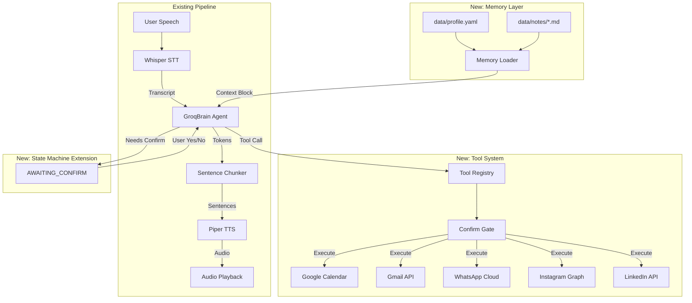
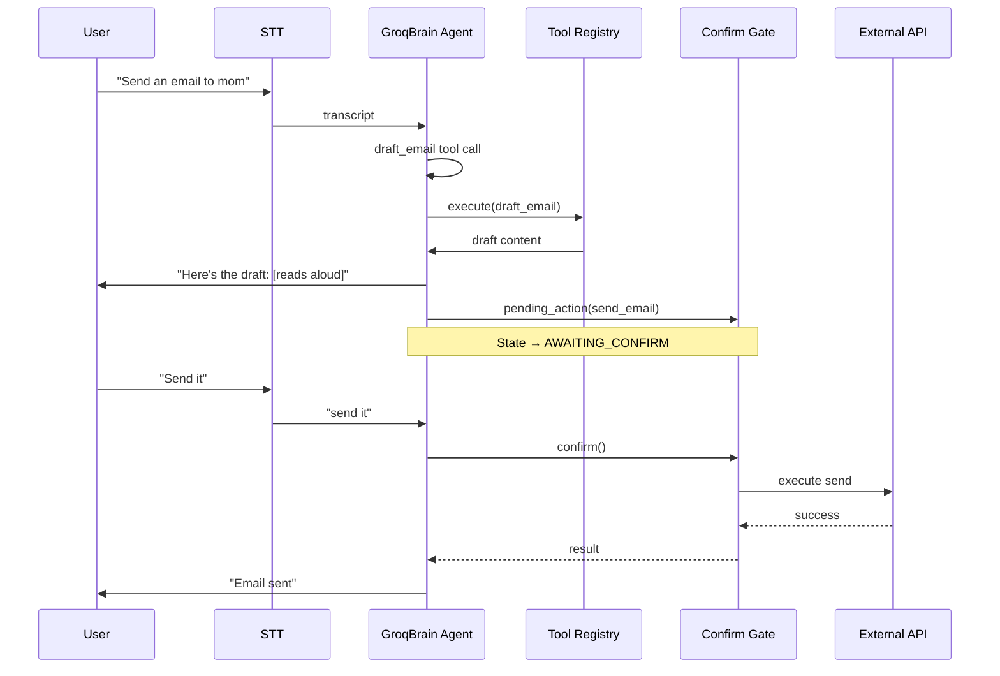
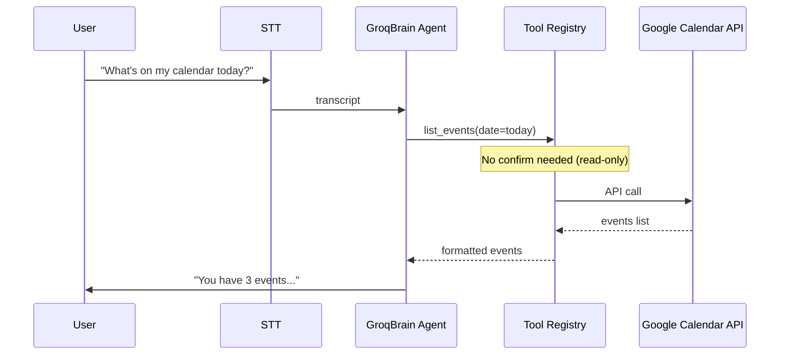
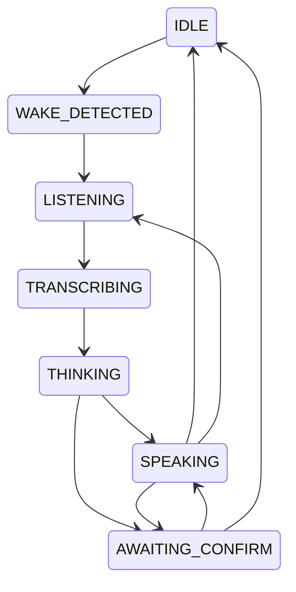

# Design Document: Personal Memory + App Integrations

## Overview

This feature eliminates hallucinated personal answers by giving JARVIS a local profile and Google Calendar context, then adds a tool-calling layer with confirm-before-send semantics for Gmail, WhatsApp, Instagram, and LinkedIn connectors. The design extends the existing asyncio pipeline architecture with minimal disruption to streaming latency by keeping tool calls as discrete non-streamed round-trips while preserving the existing streaming path for pure chat.

The core innovation is a "confirm gate" that intercepts any send/post/reply action, transitions to an AWAITING_CONFIRM state, and requires explicit spoken confirmation before executing the side effect. This prevents accidental data exfiltration and gives the user a chance to review drafted content aloud.

---

## Architecture



### Sequence Diagram: Confirm-Before-Send Flow



### Sequence Diagram: Calendar Read Flow



---

## Components and Interfaces

### Component 1: Memory Loader

**Purpose**: Load local profile and notes files, build context block for system prompt injection

**Interface**:
```python
class MemoryLoader:
    def __init__(self, profile_path: Path, notes_dir: Path) -> None: ...
    
    def load_profile(self) -> Profile: ...
    def load_notes(self) -> list[Note]: ...
    def build_context_block(self) -> str: ...
    def update_profile_field(self, field: str, value: str) -> None: ...
    def add_note(self, content: str, tags: list[str] | None = None) -> None: ...
```

**Responsibilities**:
- Load and parse `data/profile.yaml` on startup
- Load all markdown files from `data/notes/`
- Build formatted context block for system prompt
- Provide methods for profile/notes updates (with confirmation)
- Enforce `do_not_invent: true` rule in generated context

### Component 2: Tool Registry

**Purpose**: Central registry of available tools with Groq function schemas

**Interface**:
```python
class ToolRegistry:
    def __init__(self, settings: Settings) -> None: ...
    
    def get_tool_schemas(self) -> list[dict]: ...
    def get_tool(self, name: str) -> Tool | None: ...
    async def execute_tool(self, name: str, arguments: dict) -> ToolResult: ...
    def requires_confirmation(self, name: str) -> bool: ...

@dataclass
class Tool:
    name: str
    description: str
    parameters: dict  # JSON Schema
    execute: Callable[[dict], Awaitable[ToolResult]]
    requires_confirmation: bool = False

@dataclass
class ToolResult:
    success: bool
    output: str | None = None
    error: str | None = None
    pending_action_id: str | None = None  # Set when awaiting confirm
```

**Responsibilities**:
- Register all available tools with their schemas
- Map tool names to executable functions
- Determine which tools require confirmation
- Execute tool calls and return results

### Component 3: Confirm Gate

**Purpose**: Store pending actions requiring confirmation, manage confirmation flow

**Interface**:
```python
class ConfirmGate:
    def __init__(self, ttl_seconds: int = 300) -> None: ...
    
    def store_pending(self, action_id: str, tool_name: str, arguments: dict, draft_summary: str) -> None: ...
    def get_pending(self, action_id: str) -> PendingAction | None: ...
    def confirm(self, action_id: str) -> PendingAction | None: ...
    def cancel(self, action_id: str) -> bool: ...
    def is_confirmation_phrase(self, text: str) -> ConfirmationResponse: ...

@dataclass
class PendingAction:
    action_id: str
    tool_name: str
    arguments: dict
    draft_summary: str
    created_at: float
    expires_at: float

class ConfirmationResponse(Enum):
    CONFIRM = auto()
    CANCEL = auto()
    AMBIGUOUS = auto()
```

**Responsibilities**:
- Store pending actions with TTL (default 5 minutes)
- Match confirmation phrases loosely ("yes", "send it", "confirm", "do it")
- Match cancellation phrases ("no", "cancel", "stop", "don't send")
- Expire stale pending actions

### Component 4: Agent Brain Extension

**Purpose**: Extend GroqBrain to support tool calling with non-streamed round-trips

**Interface**:
```python
class GroqBrain:
    # Existing
    async def stream_reply(self, user_text: str) -> AsyncIterator[str]: ...
    
    # New
    async def complete_with_tools(
        self, 
        user_text: str,
        tool_registry: ToolRegistry,
        pending_action: PendingAction | None = None
    ) -> AgentResponse: ...

@dataclass
class AgentResponse:
    response_type: ResponseType
    content: str | None = None
    tool_calls: list[ToolCall] | None = None
    pending_action: PendingAction | None = None

class ResponseType(Enum):
    DIRECT_REPLY = auto()
    TOOL_CALL = auto()
    AWAITING_CONFIRM = auto()
    CONFIRMED = auto()
```

**Responsibilities**:
- Detect when tools are needed vs pure chat
- Make non-streamed tool calls, then stream final reply
- Handle confirm/cancel responses for pending actions
- Maintain conversation history with tool results

### Component 5: Google Integration

**Purpose**: OAuth and API clients for Calendar and Gmail

**Interface**:
```python
class GoogleCalendarTool(Tool):
    async def list_events(self, date: str, max_results: int = 10) -> list[CalendarEvent]: ...
    async def create_event(self, summary: str, start: datetime, end: datetime, description: str = "") -> CalendarEvent: ...
    async def update_event(self, event_id: str, **updates) -> CalendarEvent: ...

class GmailTool(Tool):
    async def list_messages(self, query: str = "", max_results: int = 10) -> list[EmailSummary]: ...
    async def get_message(self, message_id: str) -> EmailDetail: ...
    async def draft_message(self, to: str, subject: str, body: str) -> Draft: ...
    async def send_draft(self, draft_id: str) -> SentMessage: ...
    async def send_message(self, to: str, subject: str, body: str) -> SentMessage: ...  # requires confirm
```

**Responsibilities**:
- Manage OAuth token refresh
- Calendar: list, create, update events (create requires confirm)
- Gmail: read inbox, draft, review, send (send requires confirm)

### Component 6: WhatsApp Cloud Connector

**Purpose**: Meta WhatsApp Cloud API integration

**Interface**:
```python
class WhatsAppTool(Tool):
    async def list_messages(self, phone_number: str | None = None, limit: int = 20) -> list[Message]: ...
    async def send_message(self, to: str, body: str) -> MessageSendResult: ...  # requires confirm
    async def mark_as_read(self, message_id: str) -> bool: ...
```

**Responsibilities**:
- Send/receive via Meta Cloud API (Business phone)
- Read recent inbound messages
- Send with confirmation gate

### Component 7: Instagram Graph Connector

**Purpose**: Instagram Graph API integration for Business/Creator accounts

**Interface**:
```python
class InstagramTool(Tool):
    async def get_comments(self, media_id: str, limit: int = 50) -> list[Comment]: ...
    async def reply_to_comment(self, comment_id: str, message: str) -> Comment: ...  # requires confirm
    async def get_direct_messages(self, limit: int = 20) -> list[DirectMessage]: ...
    async def send_direct_message(self, recipient_id: str, message: str) -> MessageSendResult: ...  # requires confirm
```

**Responsibilities**:
- Read comments and DMs (where API allows)
- Reply to comments with confirmation
- Send DMs with confirmation

### Component 8: LinkedIn Connector

**Purpose**: LinkedIn API integration (posts + draft-only DMs)

**Interface**:
```python
class LinkedInTool(Tool):
    async def get_profile(self) -> LinkedInProfile: ...
    async def create_post(self, commentary: str, visibility: str = "PUBLIC") -> Post: ...  # requires confirm
    async def draft_message(self, recipient_urn: str, subject: str, body: str) -> DraftMessage: ...
    # Note: No send_message - LinkedIn API doesn't expose personal messaging
```

**Responsibilities**:
- Read profile data
- Create posts with confirmation
- Draft-only DMs (explicit limitation: no send via API)

---

## Data Models

### Model 1: Profile

```yaml
# data/profile.yaml
full_name: "John Doe"
preferred_name: "John"
timezone: "America/New_York"
work:
  company: "Acme Corp"
  role: "Software Engineer"
  email: "john@acme.com"
people:
  - name: "Mom"
    relationship: "mother"
    email: "mom@example.com"
  - name: "Alice"
    relationship: "sister"
    phone: "+1-555-0100"
preferences:
  calendar_app: "google"
  email_app: "gmail"
  wake_word: "hey jarvis"
do_not_invent: true
```

**Validation Rules**:
- `full_name` and `preferred_name` are required
- `timezone` must be valid IANA timezone
- `do_not_invent` must be `true` (hardcoded rule)

### Model 2: Note

```python
@dataclass
class Note:
    title: str
    content: str
    tags: list[str]
    created_at: datetime
    source_file: Path
```

### Model 3: Calendar Event

```python
@dataclass
class CalendarEvent:
    id: str
    summary: str
    start: datetime
    end: datetime
    description: str | None = None
    location: str | None = None
    attendees: list[str] = field(default_factory=list)
```

### Model 4: Email Summary

```python
@dataclass
class EmailSummary:
    id: str
    thread_id: str
    subject: str
    sender: str
    snippet: str
    date: datetime
    is_read: bool
    is_important: bool
```

### Model 5: Pending Action

```python
@dataclass
class PendingAction:
    action_id: str
    tool_name: str
    arguments: dict
    draft_summary: str
    created_at: float
    expires_at: float
    
    def is_expired(self) -> bool:
        return time.time() > self.expires_at
```

---

## Algorithmic Pseudocode

### Main Algorithm: Process User Turn with Tools

```pascal
ALGORITHM process_turn_with_tools(user_text, tool_registry, confirm_gate, pending_action)
INPUT: user_text of type String
INPUT: tool_registry of type ToolRegistry
INPUT: confirm_gate of type ConfirmGate
INPUT: pending_action of type PendingAction or NULL
OUTPUT: response of type AgentResponse

BEGIN
  // Step 1: Handle pending confirmation if exists
  IF pending_action IS NOT NULL THEN
    confirmation ← confirm_gate.is_confirmation_phrase(user_text)
    
    IF confirmation = CONFIRM THEN
      result ← EXECUTE pending_action.tool_name WITH pending_action.arguments
      RETURN AgentResponse(type=CONFIRMED, content=result.output)
    ELSE IF confirmation = CANCEL THEN
      confirm_gate.cancel(pending_action.action_id)
      RETURN AgentResponse(type=DIRECT_REPLY, content="Cancelled.")
    ELSE
      // Ambiguous - ask for clarification
      RETURN AgentResponse(type=DIRECT_REPLY, content="Please say 'yes' to confirm or 'cancel' to abort.")
    END IF
  END IF
  
  // Step 2: Check if tools needed via LLM
  needs_tools ← CALL llm_check_needs_tools(user_text, tool_registry.get_tool_schemas())
  
  IF NOT needs_tools THEN
    // Pure chat - use existing streaming path
    RETURN AgentResponse(type=DIRECT_REPLY, content=STREAM_REPLY(user_text))
  END IF
  
  // Step 3: Non-streamed tool round-trip
  tool_calls ← CALL llm_get_tool_calls(user_text, tool_registry.get_tool_schemas())
  
  FOR each tool_call IN tool_calls DO
    // Loop invariant: all previous tool calls have been executed successfully
    ASSERT all_previous_tools_succeeded(tool_registry)
    
    tool ← tool_registry.get_tool(tool_call.name)
    
    IF tool IS NULL THEN
      CONTINUE
    END IF
    
    IF tool.requires_confirmation THEN
      // Store pending action and return for confirmation
      action_id ← GENERATE_UUID()
      draft_summary ← FORMAT_DRAFT_SUMMARY(tool_call)
      
      confirm_gate.store_pending(
        action_id,
        tool_call.name,
        tool_call.arguments,
        draft_summary
      )
      
      // Execute in "preview" mode (draft/read only)
      preview_result ← CALL tool.execute IN preview_mode WITH tool_call.arguments
      
      RETURN AgentResponse(
        type=AWAITING_CONFIRM,
        content=preview_result.output,
        pending_action=PendingAction(action_id, ...)
      )
    ELSE
      // Execute immediately
      result ← AWAIT tool.execute(tool_call.arguments)
      
      IF NOT result.success THEN
        RETURN AgentResponse(type=DIRECT_REPLY, content=result.error)
      END IF
      
      // Append tool result to conversation
      APPEND result.output TO conversation_context
    END IF
  END FOR
  
  // Step 4: Stream final reply with tool results
  final_reply ← STREAM_REPLY(user_text, include_tool_results=TRUE)
  
  RETURN AgentResponse(type=DIRECT_REPLY, content=final_reply)
END
```

**Preconditions**:
- `user_text` is non-empty string
- `tool_registry` is initialized with all available tools
- `confirm_gate` is initialized
- Conversation history is available

**Postconditions**:
- Returns valid AgentResponse
- If AWAITING_CONFIRM: pending action stored with unique ID
- If CONFIRMED: side effect executed exactly once
- If CANCEL: no side effect executed
- Streaming responses are properly chunked for TTS

**Loop Invariants**:
- All processed tool calls have valid tool references
- Tool execution order matches dependency order
- No partial state: either all tools succeed or error is returned

### Algorithm: Confirmation Phrase Matching

```pascal
ALGORITHM is_confirmation_phrase(text)
INPUT: text of type String
OUTPUT: response of type ConfirmationResponse

BEGIN
  normalized ← LOWERCASE(text)
  normalized ← STRIP_WHITESPACE(normalized)
  
  // Confirmation phrases
  confirm_phrases ← ["yes", "yeah", "yep", "send it", "confirm", "do it", 
                     "go ahead", "proceed", "okay", "ok", "sure"]
  
  // Cancellation phrases
  cancel_phrases ← ["no", "cancel", "stop", "don't send", "dont send",
                    "abort", "nevermind", "never mind", "wait"]
  
  // Check confirmation (substring match for natural speech)
  FOR each phrase IN confirm_phrases DO
    IF normalized CONTAINS phrase THEN
      RETURN CONFIRM
    END IF
  END FOR
  
  // Check cancellation
  FOR each phrase IN cancel_phrases DO
    IF normalized CONTAINS phrase THEN
      RETURN CANCEL
    END IF
  END FOR
  
  // Ambiguous or unrelated
  RETURN AMBIGUOUS
END
```

**Preconditions**:
- `text` is a non-null string (may be empty)

**Postconditions**:
- Returns CONFIRM if text matches confirmation pattern
- Returns CANCEL if text matches cancellation pattern
- Returns AMBIGUOUS otherwise
- Case-insensitive matching
- Substring matching allows natural variations ("yes please", "yeah send it")

### Algorithm: Build Memory Context Block

```pascal
ALGORITHM build_context_block(profile, notes)
INPUT: profile of type Profile
INPUT: notes of type list[Note]
OUTPUT: context_block of type String

BEGIN
  // Start with hard anti-hallucination rule
  context ← "## PERSONAL CONTEXT\n\n"
  context ← context + "### CRITICAL RULE\n"
  context ← context + "NEVER invent personal facts, preferences, or schedule items. "
  context ← context + "If you don't have information about the user, say so and offer to help add it.\n\n"
  
  // Add profile data
  context ← context + "### PROFILE\n"
  context ← context + "Name: " + profile.full_name + "\n"
  context ← context + "Preferred name: " + profile.preferred_name + "\n"
  
  IF profile.work IS NOT NULL THEN
    context ← context + "Work: " + profile.work.role + " at " + profile.work.company + "\n"
  END IF
  
  // Add people
  IF profile.people IS NOT EMPTY THEN
    context ← context + "### PEOPLE\n"
    FOR each person IN profile.people DO
      context ← context + "- " + person.name + " (" + person.relationship + ")\n"
    END FOR
  END IF
  
  // Add preferences
  IF profile.preferences IS NOT EMPTY THEN
    context ← context + "### PREFERENCES\n"
    FOR each pref IN profile.preferences DO
      context ← context + "- " + pref.key + ": " + pref.value + "\n"
    END FOR
  END IF
  
  // Add notes (summarized if too long)
  IF notes IS NOT EMPTY THEN
    context ← context + "### NOTES\n"
    FOR each note IN notes DO
      IF LENGTH(note.content) > 500 THEN
        summary ← SUMMARIZE(note.content, max_length=200)
        context ← context + "- [" + note.title + "] " + summary + "\n"
      ELSE
        context ← context + "- [" + note.title + "] " + note.content + "\n"
      END IF
    END FOR
  END IF
  
  RETURN context
END
```

**Preconditions**:
- `profile` is valid Profile object (at minimum has `full_name`)
- `notes` is list of Note objects (may be empty)

**Postconditions**:
- Returns formatted context block string
- Anti-hallucination rule is first and prominent
- Context stays under token budget (summarize long notes)
- All personal facts come from actual data, no synthesis

---

## Key Functions with Formal Specifications

### Function 1: complete_with_tools()

```python
async def complete_with_tools(
    self,
    user_text: str,
    tool_registry: ToolRegistry,
    pending_action: PendingAction | None = None
) -> AgentResponse
```

**Preconditions:**
- `user_text` is non-empty string
- `tool_registry` is initialized with all available tools
- `self._client` is valid AsyncGroq client
- If `pending_action` is provided, it is not expired

**Postconditions:**
- Returns valid AgentResponse
- If `response_type == AWAITING_CONFIRM`: pending action is stored in ConfirmGate
- If `response_type == CONFIRMED`: side effect executed exactly once
- If `response_type == CANCEL`: no side effect executed
- Conversation history updated with user message and assistant response

**Loop Invariants:**
- For tool execution loop: all previous tools in batch executed successfully
- Tool results appended to messages before final reply

### Function 2: store_pending()

```python
def store_pending(
    self,
    action_id: str,
    tool_name: str,
    arguments: dict,
    draft_summary: str
) -> None
```

**Preconditions:**
- `action_id` is unique string
- `tool_name` references a registered tool
- `arguments` is valid dict for the tool
- `draft_summary` is non-empty string

**Postconditions:**
- Pending action stored with current timestamp
- Expiration set to `now + ttl_seconds`
- Can be retrieved via `get_pending(action_id)`
- Overwrites any existing action with same ID

### Function 3: execute_tool()

```python
async def execute_tool(
    self,
    name: str,
    arguments: dict,
    preview_mode: bool = False
) -> ToolResult
```

**Preconditions:**
- `name` is registered tool name
- `arguments` matches tool's parameter schema
- External API credentials are valid (if required)

**Postconditions:**
- Returns valid ToolResult
- If `success == True`: output contains formatted result
- If `success == False`: error contains descriptive message
- If `preview_mode == True`: no side effects executed (draft/read only)
- If tool requires confirmation and `preview_mode == False`: stores pending action

---

## Example Usage

### Example 1: Pure Chat (No Tools)

```python
# User: "What time is it?"
response = await agent.complete_with_tools(
    user_text="What time is it?",
    tool_registry=registry,
    pending_action=None
)
# response.response_type == DIRECT_REPLY
# response.content == "It's currently 3:45 PM in New York."
```

### Example 2: Calendar Read (Tool, No Confirm)

```python
# User: "What's on my calendar today?"
response = await agent.complete_with_tools(
    user_text="What's on my calendar today?",
    tool_registry=registry,
    pending_action=None
)
# response.response_type == DIRECT_REPLY
# response.content == "You have 3 events today: Team standup at 9 AM, ..."
# Tool 'list_events' executed immediately (read-only, no confirm needed)
```

### Example 3: Email Draft + Confirm Flow

```python
# User: "Send an email to mom asking about dinner"
response = await agent.complete_with_tools(
    user_text="Send an email to mom asking about dinner",
    tool_registry=registry,
    pending_action=None
)
# response.response_type == AWAITING_CONFIRM
# response.content == "Here's a draft: 'Hi Mom, Would you like to get dinner this weekend? Love, John'"
# response.pending_action stored in confirm_gate

# User: "Send it"
response2 = await agent.complete_with_tools(
    user_text="Send it",
    tool_registry=registry,
    pending_action=response.pending_action
)
# response2.response_type == CONFIRMED
# response2.content == "Email sent to mom@example.com"
```

### Example 4: Cancel Flow

```python
# User: "Send an email to mom asking about dinner"
response = await agent.complete_with_tools(...)
# response.response_type == AWAITING_CONFIRM

# User: "Actually, cancel that"
response2 = await agent.complete_with_tools(
    user_text="Actually, cancel that",
    tool_registry=registry,
    pending_action=response.pending_action
)
# response2.response_type == DIRECT_REPLY
# response2.content == "Cancelled. No email was sent."
```

---

## Correctness Properties

### Property 1: No Unconfirmed Side Effects

```
∀ tool_call ∈ ToolCalls:
  requires_confirmation(tool_call.name) ⟹
    (pending_action_created ∧ side_effect_executed ⟺ user_confirmed)
```

**Test**: Attempt to send email without confirmation - should return AWAITING_CONFIRM, not execute send.

### Property 2: No Hallucinated Personal Facts

```
∀ response ∈ Responses:
  contains_personal_fact(response) ⟹
    fact_source(response) ∈ {profile, notes, calendar_api}
```

**Test**: Ask about preferences not in profile - should respond "I don't have that saved" rather than inventing.

### Property 3: Confirmation Uniqueness

```
∀ pending_action ∈ ConfirmGate:
  pending_action.action_id is unique ∧
  pending_action.expires_at > now()
```

**Test**: Store two pending actions with same ID - second overwrites first, no duplicates.

### Property 4: Tool Execution Atomicity

```
∀ tool_batch ∈ ToolCallBatch:
  (∀ tool ∈ tool_batch: execute(tool).success) ∨
  (∃ tool ∈ tool_batch: execute(tool).error ∧ rollback(previous_tools))
```

**Test**: Mock tool failure mid-batch - either all succeed or error returned before final reply.

### Property 5: Memory Context Injection

```
∀ request ∈ LLMRequests:
  system_prompt_contains(request, anti_hallucination_rule) ∧
  system_prompt_contains(request, profile_context)
```

**Test**: Make any request - verify system prompt includes profile data and do-not-invent rule.

---

## Error Handling

### Error Scenario 1: OAuth Token Expired

**Condition**: Google API returns 401 Unauthorized
**Response**: Attempt token refresh, retry once
**Recovery**: If refresh fails, prompt user to re-run OAuth setup script

### Error Scenario 2: Tool Not Found

**Condition**: LLM hallucinates a tool name not in registry
**Response**: Return error message, suggest available tools
**Recovery**: Continue conversation without executing

### Error Scenario 3: Pending Action Expired

**Condition**: User tries to confirm action after TTL
**Response**: Return "That action has expired. Please try again."
**Recovery**: Clear from ConfirmGate, let user retry

### Error Scenario 4: API Rate Limit

**Condition**: External API returns 429 Too Many Requests
**Response**: Return friendly error, suggest retry time
**Recovery**: Exponential backoff for retries

### Error Scenario 5: Network Timeout

**Condition**: API call exceeds timeout
**Response**: Return timeout error after configured duration
**Recovery**: Allow user to retry

---

## Testing Strategy

### Unit Testing Approach

- Mock tool registry with test tools
- Test confirmation phrase matching (positive, negative, ambiguous)
- Test pending action storage and expiration
- Test context block generation
- Test error handling paths

### Property-Based Testing Approach

**Property Test Library**: hypothesis (Python)

**Properties to Test**:
1. Confirmation phrase matching is deterministic
2. Context block generation never produces empty output for valid profile
3. Pending action IDs are unique
4. Tool schema generation produces valid JSON Schema

```python
# Example property test
from hypothesis import given, strategies as st

@given(st.text(alphabet=st.characters(whitelist_categories=('Lu', 'Ll', 'Nd'))))
def test_confirmation_phrase_deterministic(text):
    result = confirm_gate.is_confirmation_phrase(text)
    assert result in (CONFIRM, CANCEL, AMBIGUOUS)
    # Same text should always produce same result
    assert confirm_gate.is_confirmation_phrase(text) == result
```

### Integration Testing Approach

- Test with real Groq API (mocked tools)
- Test OAuth flow with test Google credentials
- Test full confirm-cancel flow end-to-end
- Test memory loading with sample profile/notes
- Test state machine transitions (IDLE → AWAITING_CONFIRM → IDLE)

---

## Performance Considerations

### Streaming Latency Preservation

- Pure chat continues using existing streaming path
- Tool calls are non-streamed round-trips (unavoidable for API calls)
- Memory context added to system prompt (one-time cost at session start)
- Target: < 100ms overhead for tool detection before streaming starts

### Memory Loading

- Profile loaded once at startup (cached)
- Notes loaded lazily on first request
- Context block built once, reused for all requests
- Target: < 50ms for profile + notes loading

### Confirm Gate

- Pending actions stored in memory (fast lookup)
- TTL cleanup runs in background (no blocking)
- Target: < 10ms for confirmation check

### API Call Budget

- Google Calendar: 1M requests/day free tier
- Gmail: 1B requests/day quota
- WhatsApp Cloud: 80 messages/second
- Target: < 5 API calls per user turn

---

## Security Considerations

### OAuth Token Storage

- Tokens stored in `data/google_token.json` (gitignored)
- File permissions: 600 (owner read/write only)
- Refresh tokens encrypted at rest (optional, user choice)

### Confirm Gate as Safety Mechanism

- ALL send/post/reply actions require confirmation
- No bypass mechanism (hard requirement)
- Confirmation timeout prevents accidental execution

### Profile Data Protection

- Profile file is local only
- No cloud sync of personal data
- User controls all profile content
- `do_not_invent: true` enforced at system prompt level

### API Credentials

- All secrets in `.env` (gitignored)
- Never logged or exposed in responses
- Separate credentials per platform

### Voice Confirmation

- Confirmation must be spoken (not typed in chat)
- Wake word required before confirmation
- Prevents accidental execution from background noise

---

## Dependencies

### Python Packages

- `groq` - Groq API client (existing)
- `google-auth` - Google OAuth
- `google-auth-oauthlib` - OAuth flow
- `google-auth-httplib2` - HTTP transport
- `google-api-python-client` - Gmail and Calendar APIs
- `pyyaml` - Profile parsing
- `httpx` - HTTP client for Meta/LinkedIn APIs

### External APIs

- **Groq API**: LLM inference (existing)
- **Google Calendar API**: Calendar read/write
- **Gmail API**: Email read/draft/send
- **WhatsApp Cloud API**: Messaging (Meta)
- **Instagram Graph API**: DMs and comments (Meta)
- **LinkedIn API**: Profile and posts

### Configuration Files

- `.env` - API keys and secrets
- `data/profile.yaml` - User profile
- `data/notes/*.md` - User notes
- `data/google_token.json` - OAuth token (generated)

---

## State Machine Extension

### New State: AWAITING_CONFIRM

```python
class PipelineState(Enum):
    IDLE = auto()
    WAKE_DETECTED = auto()
    LISTENING = auto()
    TRANSCRIBING = auto()
    THINKING = auto()
    SPEAKING = auto()
    AWAITING_CONFIRM = auto()  # NEW
```

### Transition Rules

```python
_TRANSITIONS: dict[PipelineState, set[PipelineState]] = {
    # Existing transitions...
    PipelineState.THINKING: {
        PipelineState.SPEAKING,
        PipelineState.IDLE,
        PipelineState.LISTENING,  # barge-in
        PipelineState.AWAITING_CONFIRM,  # NEW: tool needs confirmation
    },
    PipelineState.AWAITING_CONFIRM: {
        PipelineState.SPEAKING,  # confirmed - speak result
        PipelineState.IDLE,      # cancelled
        PipelineState.LISTENING, # barge-in
    },
    PipelineState.SPEAKING: {
        PipelineState.IDLE,
        PipelineState.LISTENING,
        PipelineState.WAKE_DETECTED,
        PipelineState.AWAITING_CONFIRM,  # NEW: while speaking draft
    },
}
```

### State Flow Diagram


