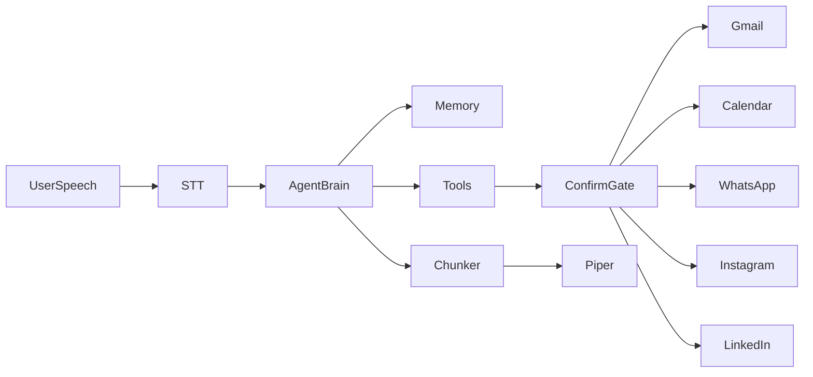

# JARVIS personal memory + Phase 1 app integrations

## Why it invents facts today

`[jarvis/llm/groq_client.py](jarvis/llm/groq_client.py)` only sends a generic JARVIS system prompt + short chat history. There is no profile, calendar, or tools — so questions about “my schedule” / “about me” are pure model guesswork.

## Target architecture




- **Memory**: local files JARVIS always loads into the system prompt (and can update via voice with confirmation).
- **Agent brain**: Groq chat with **tool calls** (non-streamed tool round-trips, then stream the final spoken reply for low latency TTS).
- **Confirm gate**: any `send` / `post` / `reply` tool requires an explicit spoken confirm turn (`yes` / `send it` / `cancel`) before the side effect runs.

## Platform reality (locked choices)


| App             | Implementation                                                     | What “manage” means in Phase 1                                                                                                 |
| --------------- | ------------------------------------------------------------------ | ------------------------------------------------------------------------------------------------------------------------------ |
| Profile + notes | Local YAML/Markdown                                                | Answer “who am I / preferences” from your files only                                                                           |
| Google Calendar | Official Google Calendar API (OAuth)                               | List today/week, create/update events (create confirms)                                                                        |
| Gmail           | Official Gmail API (OAuth)                                         | Read/summarize inbox, draft, **review aloud**, send after confirm                                                              |
| WhatsApp        | **Meta WhatsApp Cloud API** (Business phone number)                | Read recent inbound (webhooks), draft + send after confirm                                                                     |
| Instagram       | **Instagram Graph API** (Business/Creator linked to Facebook Page) | Read recent DMs/comments where API allows; draft + send/reply after confirm                                                    |
| LinkedIn        | Official LinkedIn API                                              | Read profile; create posts after confirm; **DMs are draft-only** (LinkedIn does not expose personal messaging for normal apps) |


You will need Google Cloud OAuth credentials, a Meta developer app (WhatsApp + Instagram), and a LinkedIn developer app. Personal consumer WhatsApp/Instagram accounts without Business setup cannot be fully automated via official APIs.

## Soft rule: confirm before send

New orchestrator state path while speaking a draft:

`THINKING → AWAITING_CONFIRM → (user yes) EXECUTE → SPEAKING result`  
or `(user cancel/no) → SPEAKING “cancelled” → IDLE`

Confirmation phrases matched loosely: yes, yeah, send it, confirm, do it / no, cancel, stop, don’t send.

## Data layout

```
data/
  profile.yaml          # name, preferences, people, routines
  notes/                # freeform markdown facts JARVIS may cite
  google_token.json     # OAuth token (gitignored)
  meta_*.env secrets in .env only
```

Example `profile.yaml` fields: `full_name`, `preferred_name`, `timezone`, `work`, `people[]`, `preferences`, `do_not_invent: true`.

System prompt rule (hard): **Never invent personal facts or schedule items. If unknown, say you don’t have that saved and offer to add it.**

## Code changes (main files)

1. **Memory** — new `jarvis/memory/profile.py`
  Load profile + notes; `build_context_block()` injected into system prompt in `[jarvis/llm/groq_client.py](jarvis/llm/groq_client.py)`.
2. **Tools framework** — new `jarvis/tools/`
  - `base.py` — tool schema + registry  
  - `confirm.py` — pending action store  
  - `calendar_google.py`, `gmail.py`, `whatsapp_meta.py`, `instagram_meta.py`, `linkedin.py`  
  - `memory_tools.py` — `save_note`, `update_profile_field` (confirm for profile writes)
3. **Agent loop** — extend `GroqBrain`
  - `complete_with_tools(user_text)` → tool rounds → final answer string (then existing sentence chunker + Piper stream)  
  - Keep streaming path for pure chat when no tools needed
4. **Orchestrator** — `[jarvis/orchestrator/pipeline.py](jarvis/orchestrator/pipeline.py)` + `[state.py](jarvis/orchestrator/state.py)`
  Wire `AWAITING_CONFIRM`; on confirm, run pending tool; speak result.
5. **Config / secrets** — `[jarvis/config.py](jarvis/config.py)`, `[.env.example](.env.example)`
  Google client id/secret, Meta WA token/phone id, Instagram page ids, LinkedIn client credentials; `REQUIRE_SEND_CONFIRM=true`.
6. **OAuth helper** — `scripts/google_oauth_setup.py` (one-time browser login for Calendar + Gmail scopes).
7. **Smoke tests** — mocked tool registry + confirm gate unit tests; live Gmail/Calendar only when tokens present.

## Build order

1. Profile/notes memory + anti-hallucination system prompt (fixes “random info about me”) ← done
2. Tool registry + confirm gate + orchestrator state ← done
3. Google OAuth → Calendar read/create + Gmail read/draft/send ← done
4. WhatsApp Cloud API connector ← done
5. Instagram Graph connector ← done
6. LinkedIn connector (posts + draft-only DMs) ← done
7. Voice UX polish: “Here’s the draft… Say send it or cancel.” ← done

## Out of scope for this phase

- Unofficial WhatsApp Web / Instagram / LinkedIn browser automation  
- Full LinkedIn inbox automation (API unavailable)  
- Auto-send without confirmation

